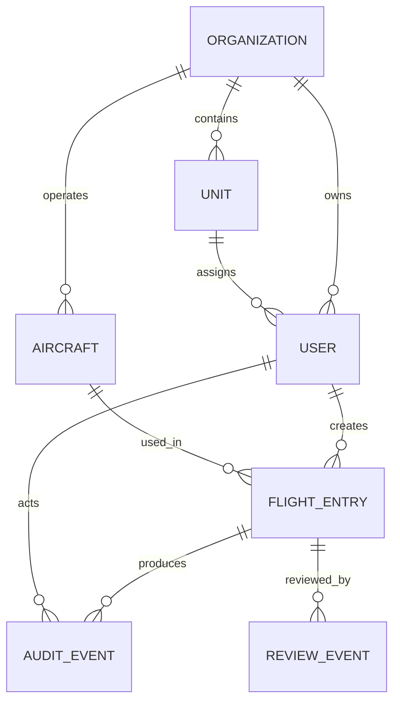

# FlyLogX Architecture

## Overview

FlyLogX is structured as a role-aware, audit-first system for digital flight logbooks.

## High-Level Components

- Web frontend for pilots, supervisors, and administrators
- FastAPI backend for authentication, business rules, and reporting
- PostgreSQL for persistent, revision-safe storage
- Object/file storage for exports and attachments
- Background jobs for PDF export, reminders, and maintenance workflows

## Core Domain Model

## Primary Entities

- Organization and unit hierarchy
- Users, roles, and permissions
- Aircraft registry with maintenance state
- Flight entries with draft/submitted/reviewed/approved/rejected states
- Review workflow with comments and signatures
- Audit events and change history

## API Surface

- `/api/auth/*`
- `/api/users/*`
- `/api/organizations/*`
- `/api/aircraft/*`
- `/api/flights/*`
- `/api/dashboards/*`
- `/api/reviews/*`
- `/api/audit/*`
- `/api/exports/*`

## Security Model

- JWT-based authentication
- server-side permission checks
- soft-delete semantics
- immutable audit events for all changes
- separation of pilot, supervisor, and admin privileges

## UI Structure

- Top navigation for global actions
- Left navigation for modules
- Dashboard landing pages per role
- Filterable tables for flight logs and aircraft
- Structured review forms for validation and approvals
- Print/PDF views that mirror a physical logbook
